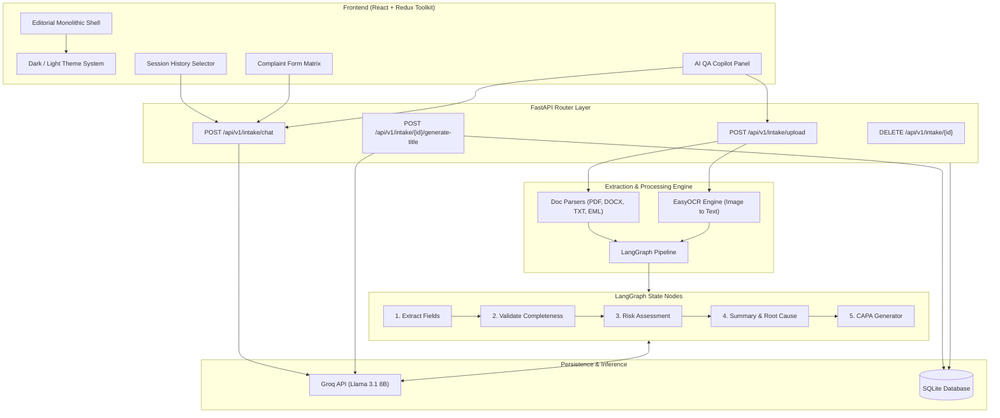

# AIVOA.AI - Pharmaceutical QA Complaint Management Platform

AIVOA.AI is an enterprise-grade Quality Assurance (QA) Complaint Management Platform designed specifically for the pharmaceutical industry. It automates the intake, data extraction, risk classification, root cause analysis, and CAPA (Corrective and Preventive Actions) recommendations for customer product complaints using generative AI and LangGraph state orchestration.

---

## Architectural Workflow & System Diagram

The system combines a React (Vite) Redux frontend adhering to Editorial Monolithic aesthetics with a FastAPI backend powered by LangGraph node workflows, EasyOCR image processing, and Groq LLM inference (`llama-3.1-8b-instant`).



---

## Core Features

- **Multi-Format Document & Image OCR Intake**: Drag-and-drop or attach PDF, DOCX, TXT, EML email files, or raw image formats (PNG, JPG, JPEG) powered by EasyOCR.
- **Conversational QA Copilot**: Context-aware assistant that extracts structured fields while acknowledging user complaints with structured next-step checklists.
- **Persistent Dark & Light Mode**: Application-wide theme switcher (`[ DARK ]` / `[ LIGHT ]`) with persistent `localStorage` preference and high-contrast typography tokens.
- **Dynamic Session Title Generation**: Auto-generates concise 3-5 word conversation titles with a typewriter text animation.
- **Editorial Monolithic Aesthetic**: Asymmetric 60/40 grid layout, zero rounded corners (`border-radius: 0`), zero box shadows, zero gradients, and 1px structural grid lines.
- **In-Place Confirmation Actions**: Eliminates browser-native `window.confirm` dialogs in favor of sleek, in-place deletion controls.
- **Audit Trail & Risk Assessment**: Automated severity (Critical/Major/Minor) and priority (High/Medium/Low) determination with rationale logging and suggested QA actions.

---

## Edge Cases & Architectural Quirks

### 1. Sequential Upload-and-Chat Execution
- **Problem**: Uploading a document and typing a chat message simultaneously used to trigger a race condition where the AI chatted before document extraction finished.
- **Solution**: Bundles chat text inside the `/upload` payload. The backend extracts the document first, updates the payload, and *then* executes the Copilot response using the newly populated fields.

### 2. Relative Date Guardrails
- **Quirk**: Users often input vague dates like *"expiry date was 6 months ago"* or *"bought recently"*.
- **Rule**: The extraction pipeline explicitly leaves structured ISO date fields as `null` and instructs the Copilot to politely request exact `YYYY-MM-DD` values.

### 3. Template Parroting Prevention
- **Quirk**: Smaller 8B parameter models frequently copy schema examples (outputting literal string text like `"customer_name": "string or null"`).
- **Fix**: Schema templates use strict `null` defaults with comments, paired with a post-processing filter that purges literal string `"null"` outputs into Python `None` objects.

### 4. Competitor Brand & Pharmacy Resolution
- **Quirk**: Users mention store names and competitor products in one sentence (e.g., *"I usually take Benadryl, but I bought Apollo Pharmacy Cough Syrup and it was discolored"*).
- **Fix**: Prompt directives isolate the primary complaint subject (`product_name: "Cough Syrup"`), distinguish retailer names (`company_name: "Apollo Pharmacy"`), and ignore competitor mentions (`Benadryl`).

### 5. Risk Assessment Override Protection
- **Quirk**: Automated risk models could overwrite explicit user inputs.
- **Fix**: Post-processing logic ensures user-specified severity and priority values are preserved and never demoted by automated algorithms.

---

## Local Development & Setup

### Prerequisites
- Node.js (v18+)
- Python (v3.10+)

### Quick Start (One Command)
Run both backend (FastAPI) and frontend (Vite React) concurrently from the repository root:

```bash
npm start
```

### Docker Compose Setup
```bash
docker-compose up --build
```
- **Frontend UI**: `http://localhost:5173`
- **FastAPI Docs**: `http://localhost:8000/docs`

---

## Project Structure

```text
.
├── backend/
│   ├── main.py                  # FastAPI entrypoint & middleware
│   ├── database.py              # SQLite database configuration
│   ├── config.py                # Environment settings
│   ├── agents/
│   │   ├── graph.py             # LangGraph state machine flow
│   │   ├── llm_client.py        # Groq Llama 3.1 client wrapper
│   │   └── prompts/templates.py # Hardened system prompts
│   ├── models/                  # SQLAlchemy ORM models
│   ├── repositories/            # Database access layer
│   ├── routers/                 # REST API endpoints
│   ├── services/                # Intake & Chat orchestration
│   └── requirements.txt
├── frontend/
│   ├── src/
│   │   ├── App.tsx              # Main Shell with Theme & Header controls
│   │   ├── index.css            # Editorial CSS Variables (Light & Dark)
│   │   ├── features/aiIntake/   # Chat Copilot & Attachment components
│   │   └── features/complaintForm/ # 14-Field Form Matrix & Badges
│   ├── package.json
│   └── vite.config.ts
├── samples/                     # Test complaint documents (EML, TXT)
├── docker-compose.yml
└── package.json                 # Root script runner (npx concurrently)
```
