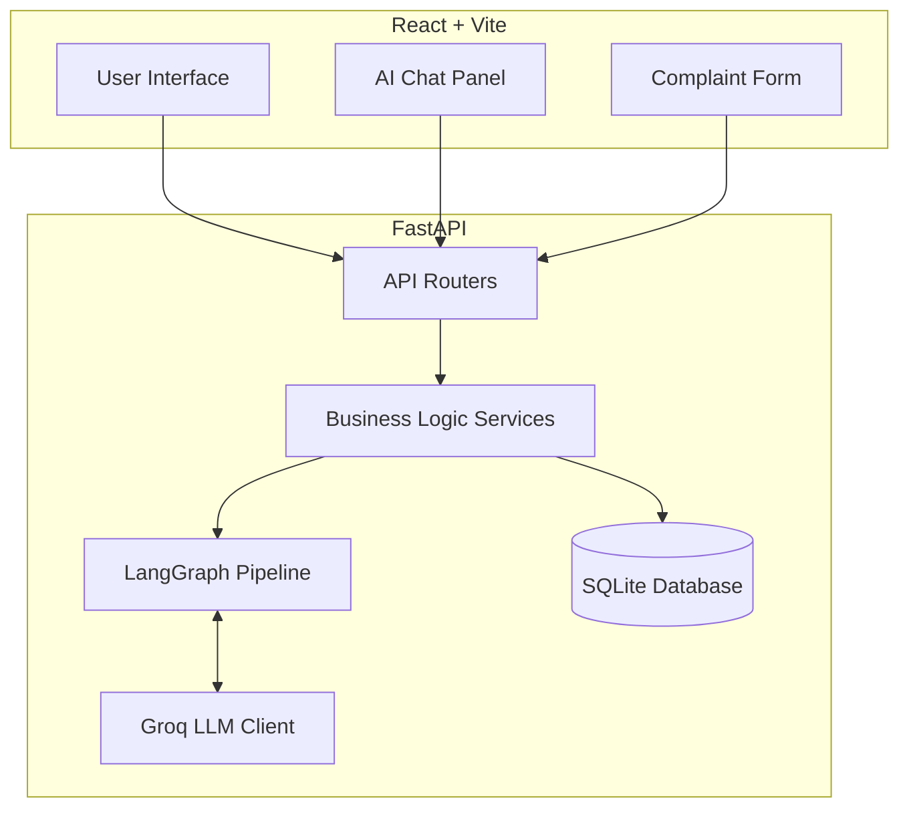

# AIVOA.AI - Pharma QA Complaint Management System

AIVOA.AI is an AI-powered Quality Assurance (QA) Complaint Management System designed for the pharmaceutical industry. It streamlines the process of logging, tracking, and analyzing product complaints using generative AI.

## Architecture

The system consists of a FastAPI backend and a React (Vite) frontend. The backend utilizes LangGraph for orchestration and Groq for LLM inference.



## Features

- **AI-Driven Data Extraction**: Automatically extracts complaint details from uploaded documents (PDF, TXT, DOCX, EML) or pasted text.
- **Natural Language Chat**: Allows users to log or edit complaints using a conversational interface.
- **Risk Assessment**: AI evaluates the severity and priority of complaints and proposes actions.
- **Audit Trail**: Preserves the original AI suggestions for severity and priority.
- **Real-time Updates**: Uses Server-Sent Events (SSE) to stream pipeline progress to the frontend.

## Deployment

### Local Setup with Docker Compose

1. Clone the repository.
2. Create a `.env` file in the `backend/` directory and set your `GROQ_API_KEY`.
3. Run the following command:

```bash
docker-compose up --build
```

The frontend will be available at `http://localhost:5173` and the backend at `http://localhost:8000`.

## Guidelines

- **No Emojis**: This project strictly prohibits the use of emojis in the codebase, UI, and documentation.
- **YAGNI**: You Aren't Gonna Need It. Only implement what is explicitly required.

